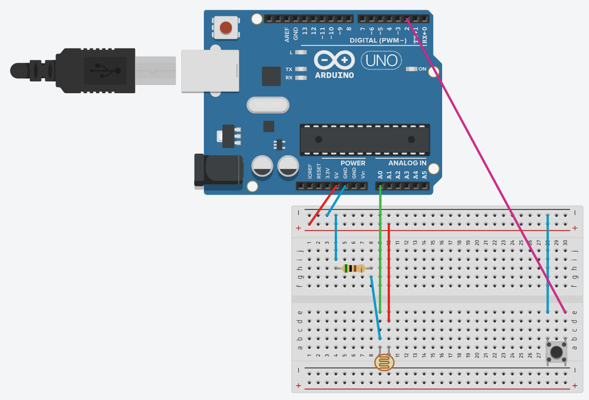

# [DEPRECATED]
Please use the [newer verison](https://github.com/AndyFilter/LatencyMeterRefreshed). Re-written on **DirectX11** backend without using WinForms.

# Latency-Meter
This program lets you measure latency of your system given that you have arduino.

<h3>It requires arduino running code from \Arduino\SystemLatencyMeter\SystemLatencyMeter.ino</h3>

So... This is my First c++ code, pls be gentle. There is so much garbage and useless code that is perhaps slowing evrything down that It's unbelivable but that's why I put it on Git, to solve those issues with the help of this amazing community!

Arduino Pin configuration should as follows:

<b>Light_Sensor - A0,  </b>
<b>Button - 2 </b>

I would recommend putting a 500Ω resistor in series with the light sensor. The button is configured to use a arduino UNO built-in "pullup" resistor" (button, INPUT_PULLUP)

Remainder! button is reversed, I mean the code detects press of a button normally, but the state is different (if(buttonState == LOW)). All it means is that you plug it to Digital Pin 2 and Ground.
